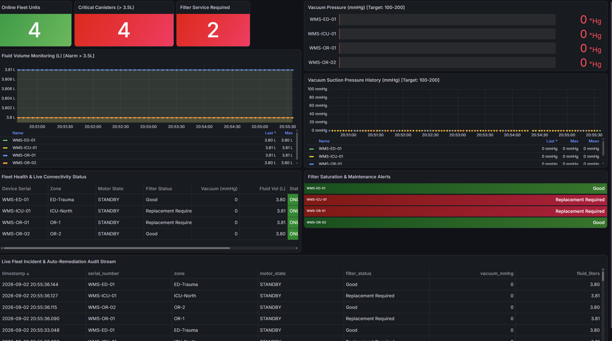

# Medical-IoT Telemetry & Auto-Remediation Pipeline

A secure, containerized, and automated telemetry pipeline engineered for clinical suction and fluid Waste Management Systems (WMS) operating in high-acuity environments (OR, ICU, Trauma). Built to handle real-time edge telemetry, TLS-encrypted MQTT messaging, TimescaleDB metric ingestion, automated IT incident ticketing, closed-loop safety remediation, and interactive Grafana observability.

---

## Real-Time Observability & Fleet Telemetry



* **Live Fleet Status**: Real-time tracking of motor states, suction pressure ($mmHg$), and waste fluid volume ($L$).
* **Failsafe Telemetry**: Visual indicators for automated `STANDBY` interlocks when canister volumes breach safe operating thresholds ($\ge 3.5L$ warning, $\ge 3.8L$ emergency cut-off).
* **Maintenance & Filter Health**: Instant visual alerts for vacuum saturation and canister maintenance cycles.

---

## 1. System Architecture Topology

```text
               +---------------------------------------------+
               |         Multi-Device Edge Simulator         |
               | (WMS-OR-01, WMS-OR-02, WMS-ICU-01, ED-01)   |
               +---------------------------------------------+
                        |                          ^
      Telemetry Publish | (TLS 8883 / Port 1883)   | Subscriptions (Control)
                        v                          |
               +---------------------------------------------+
               |        Eclipse Mosquitto MQTT Broker        |
               |      (ACL-enforced, Secret Auth)            |
               +---------------------------------------------+
                        |                          ^
      Telemetry Consume |                          | Control Dispatch
                        v                          |
         +-----------------------------+           |
         |        mqtt_consumer        |           |
         | (Failsafe & Ingestion Loop) |           |
         +-----------------------------+           |
              |                   |                |
   Postgres / |        Incident   | HTTP Webhook   |
  TimescaleDB |        Trigger    v                |
              |         +-------------------+      |
              |         | Ticketing Service |      |
              |         |   (Port 6000)     |      |
              |         +-------------------+      |
              v                                    |
   +----------------------+                        |
   |     TimescaleDB      |                        |
   | (PostgreSQL 16 Hypr) |                        |
   +----------------------+                        |
        ^            ^                             |
        |            |                             |
 Queries|     Queries|                             |
        |            +-------------------+         |
        |                                |         |
+---------------+              +-----------------------+
|  Grafana NOC  |              |  FastAPI Gateway API  |
|  (Port 3000)  |              |  (Port 8000 /api/v1)  |
+---------------+              +-----------------------+
```

---

## 2. Telemetry Ingestion & Control Specifications

### MQTT Topics
* **Telemetry Publish**: `hospital/devices/{serial_number}/telemetry`
* **Device Control**: `hospital/devices/{serial_number}/control`
* **Fleet Broadcast**: `hospital/devices/fleet/control`

### Telemetry Payload Schema
```json
{
  "timestamp": "2026-09-03T02:43:45.127861Z",
  "serial_number": "WMS-OR-01",
  "zone": "OR-1",
  "firmware": "v2.4.1",
  "motor_state": "RUNNING",
  "filter_status": "Good",
  "vacuum_pressure": 158.8,
  "fluid_volume": 0.28
}
```

### Safety & Auto-Remediation Failsafe
* **High Fluid Warning**: At >= 3.5 L, alerts flag on the NOC dashboard and incident tickets are opened.
* **Auto-Cutoff Failsafe**: At >= 3.8 L, the pipeline issues an immediate automated `STANDBY` command over MQTT to halt the suction pump and prevent canister overflow.

---

## 3. REST API Documentation (telemetry_api)

Base URL: `http://localhost:8000`

| Method | Endpoint | Description |
|---|---|---|
| GET | `/api/v1/health` | Service and TimescaleDB connection health check |
| GET | `/api/v1/devices` | Lists all active fleet devices and recent states |
| GET | `/api/v1/devices/{serial_number}/latest` | Returns latest telemetry frame for specific unit |
| POST | `/api/v1/devices/{serial_number}/reset` | Dispatches canister purge & filter replacement command |
| POST | `/api/v1/devices/{serial_number}/command` | Sends custom command payload (`PURGE_CANISTER`, `STANDBY`, `PARK`) |

---

## 4. Grafana Observability Console

The dashboard (`medical_iot_dashboard.json`) is automatically provisioned with:
* **Fleet KPI Badges**: Live counters for Online Units, Critical Canisters (> 3.5 L), and Filter Replacements Required.
* **Fluid Volume Monitoring (L)**: Multi-device fill level curves with static safety thresholds.
* **Vacuum Pressure Bar Gauges & Trend History (mmHg)**: Instantaneous gauges and continuous multi-device time-series (100–200 mmHg target operating envelope).
* **Fleet Health & Connectivity Table**: Real-time tabular status sorted by facility zone.
* **Live Incident & Auto-Remediation Audit Stream**: Historical log of tripped safety limits and remediation events.

---

## 5. Operations & Disaster Recovery Runbook

### Clean Cold Boot
```bash
# Tear down ephemeral volumes and containers
docker compose down -v

# Rebuild and launch entire stack detached
docker compose up -d --build
```

### Maintenance & Fleet Servicing
```bash
# Reset and purge a single unit after servicing
curl -s -X POST http://localhost:8000/api/v1/devices/WMS-OR-01/reset | jq .

# Batch purge the entire fleet
for dev in WMS-ED-01 WMS-ICU-01 WMS-OR-01 WMS-OR-02; do
  curl -s -X POST "http://localhost:8000/api/v1/devices/${dev}/reset" > /dev/null
done
```

### Automated Testing & Quality Gate
```bash
# Run flake8 linter and full unit/integration test suite
flake8 src/ tests/
pytest tests/ -v
```
